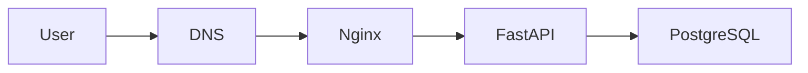

Dưới đây là **Week 2 Roadmap hoàn chỉnh + Daily Plan (3h/ngày)** theo đúng format của Week 1 để sau này bạn **viết lesson chi tiết giống mini DevOps Bootcamp**.

Mục tiêu của Week 2 là:
**đưa hệ thống ra Internet một cách an toàn và kiểm soát được.**

---

# 📅 WEEK 2 – Reverse Proxy + HTTPS + Observability Base

> Chủ đề: **“Public but controlled”**

---

# 🎯 Week 2 Strategic Outcome

Sau tuần này bạn phải đạt được:

✔ API public qua domain
✔ HTTPS production-ready
✔ Reverse proxy hoạt động ổn định
✔ Rate limiting chống abuse
✔ Log persistence sau restart
✔ Documentation engineering đầy đủ

---

# 🧠 Knowledge Targets

Bạn phải hiểu các concept sau.

## Reverse Proxy

* Reverse proxy là gì
* Proxy vs gateway
* Vì sao production luôn dùng reverse proxy
* Request flow internet → server → backend

---

## HTTP Fundamentals

* HTTP request lifecycle
* Status codes
* Headers
* Timeout concept

---

## TLS / HTTPS

* SSL vs TLS
* Public key encryption
* Certificate authority
* Handshake process

---

## Observability Basics

3 pillar:

```text
metrics
logs
traces
```

Tuần này tập trung **logs trước**.

---

# 🛠 Implementation Scope

---

# 🌐 1️⃣ Nginx Reverse Proxy

Bạn phải cấu hình:

* Proxy pass to FastAPI
* Timeout config
* Buffer config
* Rate limiting
* Security headers

Deliverables:

```text
infra/nginx/nginx.conf
docs/nginx-explained.md
```

---

# 🔒 2️⃣ HTTPS Production Setup

Phải làm:

* Domain DNS pointing
* Certbot SSL
* Auto renew
* Renewal test

Deliverables:

```text
docs/ssl-renewal-test.md
```

---

# 📊 3️⃣ Logging Persistence

Phải có:

* Volume mount logs
* Log rotation
* Access vs error log separation
* Restart container logs vẫn giữ

Deliverables:

```text
docker-compose.yml updated
docs/logging-architecture.md
```

---

# 🧾 4️⃣ Engineering Documentation

Bạn phải viết:

```text
docs/decision-log.md
docs/risk-log.md
docs/sprint1-retrospective.md
docs/architecture-v1.md
```

---

# 📆 WEEK 2 DAILY PLAN (3h/day)

---

# 🟢 Day 1 — HTTP + Reverse Proxy Fundamentals

## ⏱ Time Split

```text
Theory      70m
Hands-on    80m
Review      30m
```

---

## 📚 Knowledge

Hiểu request flow:

```text
User
 ↓
DNS
 ↓
Reverse Proxy (Nginx)
 ↓
Backend (FastAPI container)
```

---

### Reverse Proxy vs Forward Proxy

Forward proxy:

```text
client -> proxy -> internet
```

Reverse proxy:

```text
internet -> proxy -> backend
```

---

### Vì sao production cần reverse proxy?

Nginx xử lý:

* TLS termination
* rate limit
* request buffering
* static files
* load balancing

---

## 🛠 Practice

Install nginx:

```bash
sudo apt install nginx
```

Test:

```bash
curl localhost
```

---

## 📦 Deliverable

```text
docs/reverse-proxy-basics.md
```

---

# 🟢 Day 2 — Nginx Reverse Proxy Setup

## 📚 Knowledge

Hiểu các directive quan trọng:

```text
server
location
proxy_pass
proxy_set_header
```

---

### Timeout concept

Ví dụ:

```text
client gửi request
backend xử lý lâu
```

Proxy phải timeout hợp lý.

---

### Buffer concept

Nếu response lớn:

```text
nginx buffer trước khi gửi client
```

---

## 🛠 Practice

Cấu hình:

```nginx
server {
    listen 80;

    location / {
        proxy_pass http://localhost:8000;
    }
}
```

Test:

```bash
curl server-ip/health
```

---

## 📦 Deliverables

```text
infra/nginx/nginx.conf
docs/nginx-config-explained.md
```

---

# 🟢 Day 3 — Rate Limiting + Security Headers

## 📚 Knowledge

### Rate Limiting

Bảo vệ khỏi:

```text
bot
scraping
DDoS
```

Example:

```text
10 requests / second
```

---

### Security Headers

Các header phổ biến:

```text
X-Frame-Options
X-Content-Type-Options
X-XSS-Protection
```

---

## 🛠 Practice

Nginx rate limit:

```nginx
limit_req_zone $binary_remote_addr zone=api_limit:10m rate=10r/s;
```

Apply:

```nginx
limit_req zone=api_limit burst=20;
```

---

## 📦 Deliverables

```text
docs/rate-limit-test.md
```

---

# 🟢 Day 4 — Domain + DNS Setup

## 📚 Knowledge

Hiểu DNS record:

```text
A record
CNAME
```

Flow:

```text
domain -> DNS -> server IP
```

---

## 🛠 Practice

Mua domain (hoặc dùng domain có sẵn).

Add record:

```text
A -> VPS IP
```

Test:

```bash
ping yourdomain.com
```

---

## 📦 Deliverables

```text
docs/domain-setup.md
```

---

# 🟢 Day 5 — HTTPS with Certbot

## 📚 Knowledge

TLS handshake:

```text
client -> certificate request
server -> certificate
client -> verify CA
```

---

### Let’s Encrypt

Free certificate authority.

Tool:

```text
certbot
```

---

## 🛠 Practice

Install:

```bash
sudo apt install certbot
```

Run:

```bash
sudo certbot --nginx
```

Test:

```bash
https://yourdomain.com
```

---

## 📦 Deliverables

```text
docs/ssl-setup.md
```

---

# 🟢 Day 6 — Logging Persistence

## 📚 Knowledge

Hiểu:

### Access Log

```text
request logs
```

### Error Log

```text
server errors
```

---

### Log Rotation

Nếu không rotate:

```text
disk full
server crash
```

Tool:

```text
logrotate
```

---

## 🛠 Practice

Mount logs:

```yaml
volumes:
  - ./logs:/var/log/nginx
```

Test restart:

```bash
docker restart nginx
```

Logs vẫn tồn tại.

---

## 📦 Deliverables

```text
docs/logging-architecture.md
```

---

# 🟢 Day 7 — Sprint Documentation + Review

## 📚 Viết các document

### Decision Log

Example:

```text
ADR-002
Use Nginx as reverse proxy
Reason: stability + performance
```

---

### Risk Log

Example:

```text
Risk: API abuse
Mitigation: rate limiting
```

---

### Sprint Retrospective

Format:

```text
What went well
What failed
What to improve
```

---

### Architecture v1 Diagram

Mermaid example:



---

## 📦 Deliverables

```text
docs/sprint1-retrospective.md
docs/architecture-v1.md
docs/risk-log.md
```

---

# 📊 Week 2 KPI

Bạn đạt:

✔ Domain public
✔ HTTPS active
✔ Reverse proxy hoạt động
✔ Rate limit test pass
✔ Logs persisted sau restart
✔ Sprint report committed

---

# 📂 Repo Expected Structure

Sau week 2 repo sẽ thành:

```text
project-root

app/
docker/
infra/nginx/
docs/
logs/

.github/workflows/
```

---

# 🧠 Engineering Habit (bắt buộc)

Mỗi lần config phải commit:

```text
feat:
fix:
infra:
docs:
```

Ví dụ:

```text
infra: add nginx reverse proxy
```

---

# 🚀 Sau Week 2 bạn sẽ đạt level

**Junior DevOps / Backend infra aware**

Bạn sẽ hiểu:

* production reverse proxy
* HTTPS automation
* domain routing
* rate limiting
* logging persistence

Đây là **kiến thức mà 90% developer chưa từng làm.**

---

Nếu bạn muốn, bước tiếp theo mình sẽ viết luôn:

**Day 1 Lesson – Reverse Proxy & HTTP Fundamentals**

(theo format **bootcamp bài học thật**, đọc ~20 phút + lab ~90 phút + quiz).
