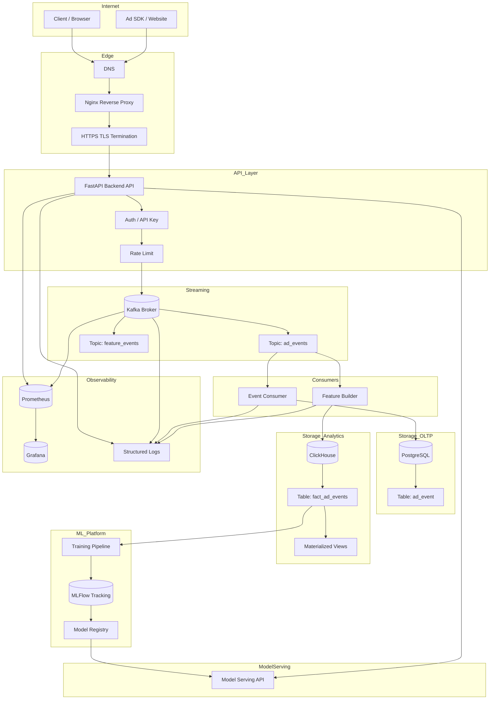
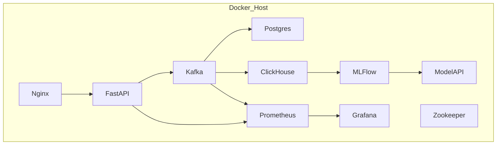
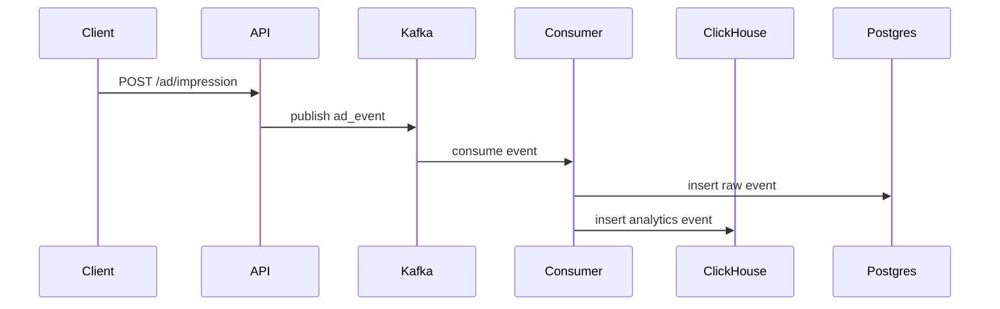
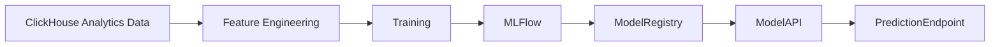
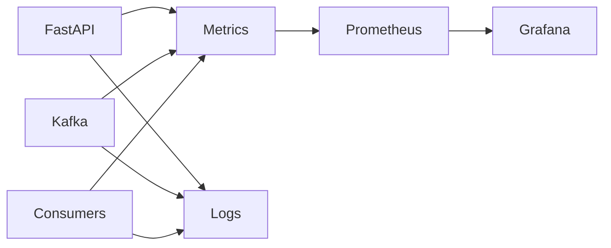

Dưới đây là **kiến trúc đầy đủ của ML Platform – Phase 1** được vẽ theo **Mermaid**.
Thiết kế này tuân theo các nguyên tắc bạn đã đặt ra:

* **Single-node nhưng production style**
* **Containerized toàn bộ**
* **Event-driven architecture**
* **Observability-first**
* **ML lifecycle chuẩn ML Ops**

Hệ thống này cũng rất phù hợp với **use-case ad impression tracking + ML prediction** mà công ty bạn đang quan tâm.

---

# 🧠 Tổng thể ML Platform – Phase 1



---

# 🧱 Kiến trúc Container (Docker Layer)

Toàn bộ hệ thống chạy trong **Docker Compose single-node**.



---

# 🔄 Event Flow (Ad Impression)

Đây là **luồng dữ liệu quan trọng nhất** của hệ thống.



---

# 🤖 ML Lifecycle Flow

Đây là **phần ML Ops thực sự**.



---

# 📊 Observability Flow



---

# 📦 Dữ liệu chính của hệ thống

### Event Schema (Ad Event)

```json
{
  "event_id": "uuid",
  "user_id": "string",
  "ad_id": "string",
  "zone_id": "string",
  "website_id": "string",
  "timestamp": "datetime",
  "device": "mobile|desktop",
  "country": "VN",
  "ip": "string"
}
```

---

# 🧩 Các Service chính

| Service    | Vai trò             |
| ---------- | ------------------- |
| Nginx      | Reverse proxy + TLS |
| FastAPI    | Backend API         |
| Kafka      | Event streaming     |
| PostgreSQL | OLTP storage        |
| ClickHouse | Analytics storage   |
| MLFlow     | Experiment tracking |
| Model API  | Model serving       |
| Prometheus | Metrics             |
| Grafana    | Dashboard           |

---

# 🎯 Sau Phase 1 bạn sẽ có

Một **ML Platform Mini giống production thật**:

```
Internet
   │
   ▼
Nginx
   │
   ▼
FastAPI API
   │
   ▼
Kafka Event Bus
   │
   ├── PostgreSQL (raw events)
   └── ClickHouse (analytics)
            │
            ▼
        ML Training
            │
            ▼
        MLFlow
            │
            ▼
        Model Serving API
```

---

# 🚀 Điều cực quan trọng tiếp theo

Sau khi có **kiến trúc**, bước tiếp theo phải làm:

```
Architecture
     ↓
Repository Structure
```

tức là thiết kế:

```
ml-platform/
    backend/
    streaming/
    analytics/
    ml/
    infra/
```

Nếu làm bước này tốt thì:

* code **không bao giờ loạn**
* AI Agent sau này **cũng quản lý được repo**
* CI/CD **rất dễ viết**

---

Nếu bạn muốn, tôi sẽ làm tiếp **bước cực quan trọng tiếp theo**:

> **Thiết kế toàn bộ repository structure của ML Platform (production-grade)**

Cái này chính là thứ phân biệt:

* **code project bình thường**
* với **ML platform chuẩn công ty công nghệ**.

---
---


Ta sẽ **breakdown PHASE 1 → cấp Sprint (2 tuần)** trước.
Sau đó mới xuống **Week → Day → Hour**.

Với 3h/ngày → ~21h/tuần → ~42h/sprint.
Mỗi sprint sẽ có **deliverable production**.

---

# 🟦 PHASE 1 — FOUNDATION ML PLATFORM

Thời gian: **3 tháng (~12 tuần)**
Cấu trúc: **6 Sprint**

| Sprint   | Focus                               | Outcome               |
| -------- | ----------------------------------- | --------------------- |
| Sprint 1 | Linux + Server Hardening + Docker   | Production-ready host |
| Sprint 2 | Backend Core + PostgreSQL           | Production API + DB   |
| Sprint 3 | Observability + Logging + Load test | Debuggable system     |
| Sprint 4 | Kafka + Streaming                   | Event pipeline        |
| Sprint 5 | ClickHouse + Analytics              | Analytics storage     |
| Sprint 6 | MLFlow + Training + Serving         | ML lifecycle          |

---

# 🟦 MONTH 1 — PRODUCTION INFRASTRUCTURE

---

# 🚀 SPRINT 1 (Week 1–2)

# Production Server & Container Platform

## Strategic Goal

Tạo **production server chuẩn DevOps**.

Không còn kiểu:

```
python app.py
```

Mà phải là:

```
Docker
Reverse Proxy
HTTPS
Firewall
Monitoring
```

---

# Knowledge Stack

### Infrastructure

* Linux production
* SSH security
* UFW firewall
* Fail2ban
* Docker
* Docker Compose

### Networking

* Nginx reverse proxy
* TLS / SSL
* Domain routing

### DevOps

* Environment config
* Secrets
* Logging basics

---

# Deliverables

Sprint kết thúc phải có:

```
Production Server
│
├── Docker Engine
├── Docker Compose stack
├── Nginx Reverse Proxy
├── HTTPS TLS
├── Firewall
├── Fail2ban
```

Server có thể deploy service qua docker.

---

# System Architecture (Sprint 1)

```
Internet
   │
   ▼
Nginx Reverse Proxy
   │
   ▼
Docker Network
   │
   ├── Backend Container
   ├── PostgreSQL Container
   └── Future services
```

---

# Bootcamp Tasks

### Infrastructure Setup

```
Install Ubuntu Server
Configure SSH
Disable password login
Enable key auth
```

---

### Security

```
UFW firewall
Fail2ban
Auto security updates
```

---

### Container Platform

```
Install Docker
Install Docker Compose
Create Docker network
```

---

### Reverse Proxy

```
Nginx container
Domain routing
HTTPS
Auto renew cert
```

---

# Sprint 1 Mini Project

Deploy:

```
FastAPI Hello World
```

Through:

```
Internet
→ Nginx
→ Docker
→ FastAPI
```

Test:

```
https://api.yourdomain.com/health
```

---

# 🟦 SPRINT 2 (Week 3–4)

# Backend Core + PostgreSQL

Sau khi có server → bắt đầu **backend core**.

---

# Strategic Goal

Xây **production API service + database layer**.

---

# Knowledge Stack

### Backend

* FastAPI
* REST API design
* Dependency injection
* Config system

### Database

* PostgreSQL advanced
* Index
* Query plan
* Connection pool

### Data Modeling

* Event model
* Ad impression schema

---

# Deliverables

Một hệ thống:

```
API Server
│
├── FastAPI
├── PostgreSQL
├── Structured logging
├── Migration system
└── Health monitoring
```

---

# Architecture

```
Client
  │
  ▼
Nginx
  │
  ▼
FastAPI
  │
  ▼
PostgreSQL
```

---

# Bootcamp Tasks

### Backend Foundation

Create project structure:

```
backend/
 ├── api
 ├── services
 ├── models
 ├── schemas
 ├── config
 └── main.py
```

---

### Config Management

```
.env
settings.py
```

---

### Database

Install:

```
PostgreSQL
SQLAlchemy
Alembic
```

---

### Data Modeling

Thiết kế bảng:

```
ad_event
```

Fields:

```
event_id
user_id
ad_id
zone_id
website_id
timestamp
device
ip
```

---

### Indexing

Thực hành:

```
timestamp index
user_id index
compound index
```

---

# Sprint 2 Mini Project

Build API:

```
POST /ad/impression
```

Insert event vào DB.

Test load:

```
1000 req/sec simulation
```

---

# 🟦 MONTH 2 — STREAMING DATA PLATFORM

---

# 🚀 SPRINT 3 (Week 5–6)

# Observability + Logging + Load Testing

---

# Strategic Goal

System **debug được khi production crash**.

---

# Knowledge Stack

### Observability

* Prometheus
* Grafana
* Metrics

### Logging

* Structured logging
* JSON logs
* Log aggregation

### Testing

* k6 load testing
* latency measurement

---

# Deliverables

```
Metrics Dashboard
API latency metrics
Request per second
Error rate
```

---

# Sprint 3 Mini Project

Dashboard:

```
API Requests
P95 latency
Error rate
CPU
Memory
```

---

# 🚀 SPRINT 4 (Week 7–8)

# Kafka Streaming

---

# Strategic Goal

Thay vì:

```
API → DB
```

Chuyển sang:

```
API → Kafka → Consumers
```

---

# Knowledge Stack

### Streaming

* Kafka architecture
* Topic
* Partition
* Consumer group

### Data Engineering

* Event schema
* Schema versioning
* Idempotent consumer

---

# Deliverables

Kafka pipeline:

```
Ad Event
  │
  ▼
Kafka Topic
  │
  ▼
Consumer
  │
  ▼
PostgreSQL
```

---

# Sprint 4 Mini Project

API:

```
POST /ad/event
```

Publish:

```
Kafka topic: ad_events
```

Consumer insert DB.

---

# 🟦 MONTH 3 — ANALYTICS + ML LIFECYCLE

---

# 🚀 SPRINT 5 (Week 9–10)

# ClickHouse Analytics

---

# Strategic Goal

Lưu **billions events** để query analytics.

---

# Knowledge Stack

### Column DB

* ClickHouse
* Partition
* MergeTree

### Data Modeling

* Time series
* Event analytics

---

# Deliverables

Query:

```
Ad impressions per hour
CTR per campaign
Top zones
```

---

# Sprint 5 Mini Project

Pipeline:

```
Kafka
  │
  ▼
ClickHouse
```

Query dashboard.

---

# 🚀 SPRINT 6 (Week 11–12)

# ML Lifecycle Production

---

# Strategic Goal

Build **ML Ops production flow**.

---

# Knowledge Stack

### ML Ops

* MLFlow
* Model registry
* Experiment tracking

### ML Platform

* Training pipeline
* Model artifact
* Serving API

---

# Deliverables

ML lifecycle:

```
Training
  │
  ▼
MLFlow
  │
  ▼
Model Registry
  │
  ▼
Model Serving API
```

---

# Sprint 6 Mini Project

Build model:

```
CTR prediction
```

Deploy:

```
POST /predict
```

---

# 🧠 Kết quả PHASE 1

Sau 3 tháng bạn sẽ có **ML platform mini**:

```
Internet
   │
   ▼
Nginx
   │
   ▼
API (FastAPI)
   │
   ▼
Kafka
   │
   ├── PostgreSQL
   └── ClickHouse
            │
            ▼
         ML Training
            │
            ▼
        MLFlow
            │
            ▼
        Model Serving
```

Đây chính là **mini architecture của công ty ads / AI platform**.

---

# Tiếp theo (rất quan trọng)

Bước tiếp theo ta sẽ làm:

```
SPRINT → WEEK
```

tức là:

```
Sprint 1
   ↓
Week 1
Week 2
```

rồi tiếp:

```
Week → Day
```

Sau đó mới xuống:

```
Day → 3h block
```

để thành **bootcamp thực sự**.

---

Nếu làm đúng cách, sau **12 tuần** bạn sẽ:

* biết **DevOps**
* biết **Data Engineering**
* biết **ML Ops**
* biết **System architecture**
* biết **production debugging**

tức là level:

```
Senior ML Platform Engineer
```

