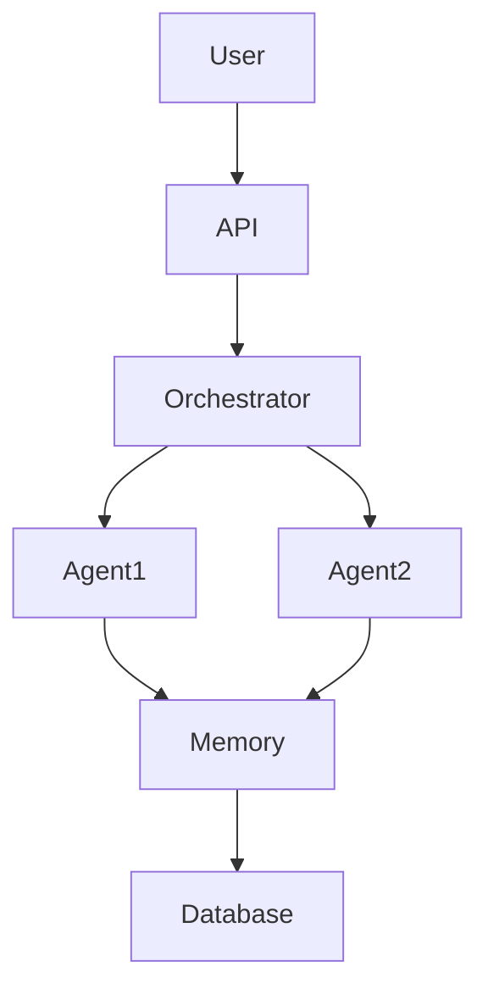

# 🟦 PHASE 1 (Month 1–3)

## OBJECTIVE:

Build Single-Node Production ML Platform (Designed-to-Scale)

---

# 📆 MONTH 1 – Infrastructure & Backend Core

## 🎯 Month 1 Strategic Outcome

* VPS production-hardened
* Dockerized system
* Reverse proxy + HTTPS
* Logging structured
* PostgreSQL production-ready
* Data model cho Ad Event system
* Basic load test
* CI/CD baseline

---

## 🔵 SPRINT STRUCTURE (Month 1)

Month 1 = 2 Sprints
Each Sprint = 2 Weeks

---

# 🟦 SPRINT 1 – Production Infrastructure Layer (Week 1–2)

## 🎯 Sprint 1 Goal

Deploy a secure, observable, containerized backend publicly accessible over HTTPS.

---

## 🔹 Deliverables

* Hardened VPS
* Docker production stack
* FastAPI service
* Nginx reverse proxy
* HTTPS (auto renew)
* Structured logging
* Project repo structure
* Decision log + Risk log
* Sprint report

---

## 🔹 Engineering Scope

### 1️⃣ Security Baseline

* SSH key-only
* Root disabled
* Firewall rules
* Fail2ban (optional enhancement)

### 2️⃣ Containerization

* Multi-stage Docker build
* Compose-based stack
* Environment separation

### 3️⃣ API Layer

* Health endpoint
* Predict mock endpoint
* Versioned API prefix

### 4️⃣ Reverse Proxy

* Nginx config
* Rate limit
* Timeout config

### 5️⃣ HTTPS

* Certbot
* Auto renew strategy

### 6️⃣ Logging

* JSON structured logging
* Log rotation
* Log persistence volume

---

## 🔹 Sprint KPI

* Public URL live
* HTTPS active
* Logs visible
* At least 12 meaningful commits
* Decision log maintained

---

# 🟦 SPRINT 2 – Database & Data Modeling (Week 3–4)

## 🎯 Sprint 2 Goal

Design and optimize relational schema for Ad Event system with production-grade DB practices.

---

## 🔹 Deliverables

* PostgreSQL containerized
* Schema design (users, ads, events, clicks)
* Index strategy documented
* Query performance benchmark
* Basic load simulation
* Migration strategy
* ER diagram
* Query optimization report

---

## 🔹 Engineering Scope

### 1️⃣ PostgreSQL Production Setup

* Resource limits
* Volume persistence
* Backup strategy (logical dump)

### 2️⃣ Data Modeling

Entities:

* user
* ad
* campaign
* event (impression, click)
* conversion

Design:

* Primary keys
* Foreign keys
* Indexing
* Composite index strategy

### 3️⃣ Performance

* EXPLAIN ANALYZE
* Index tuning
* Write-heavy vs read-heavy tradeoff

### 4️⃣ Load Testing

* Simulate event insert
* Measure latency
* Observe CPU & memory

### 5️⃣ CI/CD Extension

* Auto build + deploy DB migration
* Basic GitHub Actions workflow

---

## 🔹 Sprint KPI

* Schema documented
* ER diagram committed
* Query < acceptable latency threshold
* Load test results logged
* Sprint retrospective written

---

# 📊 End of Month 1 – You Must Be Able To:

✔ Deploy backend public
✔ Secure Linux server
✔ Understand container runtime
✔ Design relational schema
✔ Optimize query
✔ Run basic load test
✔ Document architecture decisions

If not achieved → Phase 1 unstable.

---
---

Rồi. Vào **Month 2 – Sprint Architecture**.
Đây là giai đoạn từ “người làm” → “người thiết kế hệ thống”.

---

# 🧠 MONTH 2 – SPRINT ARCHITECTURE

**Theme:** From Executor → System Designer
**Mục tiêu tháng:**

* Thiết kế được hệ thống AI Agent nhiều tầng
* Áp dụng quản lý dự án vào kiến trúc
* Biến hệ thống thành thứ có thể scale
* Bắt đầu tư duy “quản lý đội AI”

---

# 🗺 Tổng Quan 4 Sprint

| Sprint   | Chủ đề              | Output chính                  |
| -------- | ------------------- | ----------------------------- |
| Sprint 5 | System Thinking     | Vẽ full AI Agent Architecture |
| Sprint 6 | Agent Orchestration | Multi-Agent System hoạt động  |
| Sprint 7 | Memory & Knowledge  | AI có trí nhớ & RAG           |
| Sprint 8 | Project Governance  | Hệ thống có KPI + monitoring  |

---

# 🧱 SPRINT 5 – SYSTEM THINKING (Tuần 5)

## 🎯 Mục tiêu

* Hiểu kiến trúc nhiều lớp
* Thiết kế AI Agent như một công ty
* Viết System Blueprint v1

## 🏗 Nội dung

### 1️⃣ Tư duy Layer

* UI Layer
* Control Layer
* Agent Layer
* Memory Layer
* Data Layer
* Infra Layer

### 2️⃣ Vẽ kiến trúc bằng Mermaid

Ví dụ khung:

### 3️⃣ Deliverable tuần

* File: `system-architecture-v1.md`
* 3 sơ đồ kiến trúc
* 1 bản mô tả 1000 từ

---

# ⚙️ SPRINT 6 – AGENT ORCHESTRATION (Tuần 6)

## 🎯 Mục tiêu

* Nhiều agent phối hợp
* Có phân vai rõ ràng
* Có workflow

## 🧩 Thiết kế vai trò

| Agent     | Vai trò           |
| --------- | ----------------- |
| Planner   | Phân tích yêu cầu |
| Architect | Thiết kế hệ thống |
| Coder     | Sinh code         |
| Reviewer  | Review            |
| Tester    | Viết test         |
| PM Agent  | Theo dõi tiến độ  |

---

### 🛠 Thực hành

* Xây 1 Multi-agent workflow
* Dùng JSON để định nghĩa nhiệm vụ
* Ghi log từng bước

---

## Deliverable

* `multi-agent-workflow.json`
* 1 demo project chạy end-to-end
* Log trace đầy đủ

---

# 🧠 SPRINT 7 – MEMORY & KNOWLEDGE (Tuần 7)

## 🎯 Mục tiêu

* AI có trí nhớ dài hạn
* Biết đọc tài liệu dự án
* Có RAG pipeline

---

### Nội dung kỹ thuật

* Embedding
* Vector DB
* Chunking strategy
* Retrieval pipeline
* Context window optimization

---

### Thực hành

* Tạo Knowledge Base
* Cho AI đọc docs project
* Query theo ngữ cảnh

---

## Deliverable

* `knowledge-base/`
* Script ingest tài liệu
* Demo hỏi đáp theo project

---

# 📊 SPRINT 8 – PROJECT GOVERNANCE (Tuần 8)

Đây là phần quản lý lũ AI 😄

## 🎯 Mục tiêu

* AI có KPI
* Có monitoring
* Có logging
* Có cost tracking

---

## Nội dung

### 1️⃣ KPI cho Agent

* Accuracy
* Completion rate
* Hallucination rate
* Time per task
* Cost per task

### 2️⃣ Dashboard

* Grafana / custom dashboard
* Token usage
* Error rate

### 3️⃣ Incident Handling

* Retry logic
* Escalation agent
* Alert system

---

## Deliverable

* KPI spec document
* Monitoring dashboard mockup
* Incident playbook

---

# 🧨 Kết thúc Month 2 – Bạn sẽ trở thành:

* System Designer
* Multi-agent Architect
* AI Team Manager
* Có kiến trúc rõ ràng
* Có governance framework

---

# 📈 Sau Month 2 bạn có:

✔ AI Agent chạy thực tế
✔ Hệ thống có kiến trúc rõ ràng
✔ Có memory & orchestration
✔ Có monitoring
✔ Có KPI

---

Nếu Month 1 là “Bootcamp lính”,
thì Month 2 là “Học viện sĩ quan”.

---

