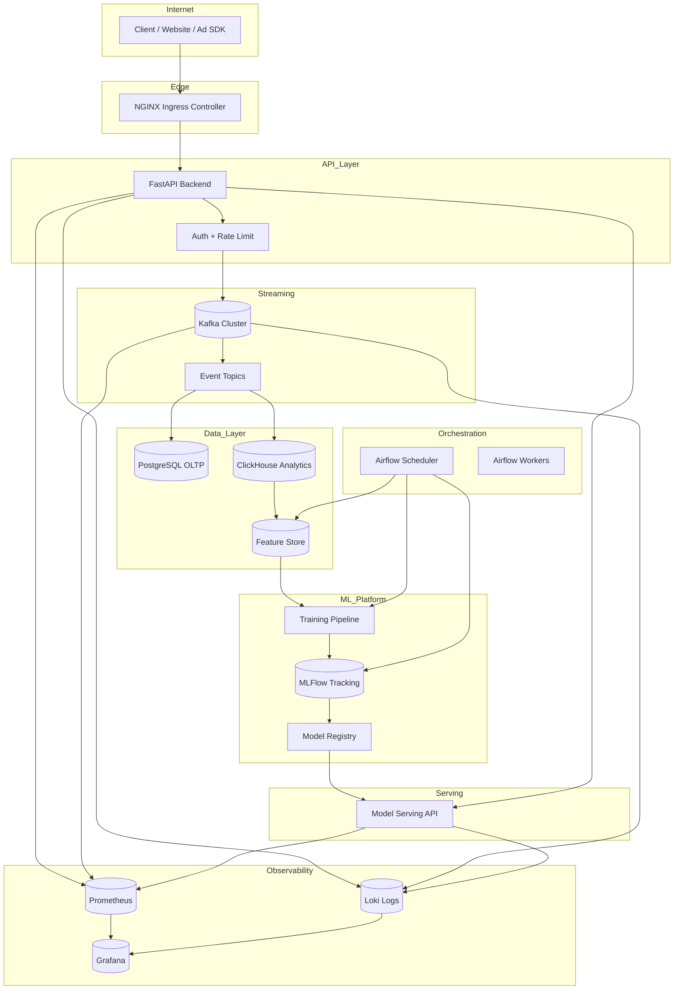
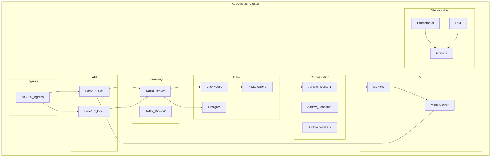
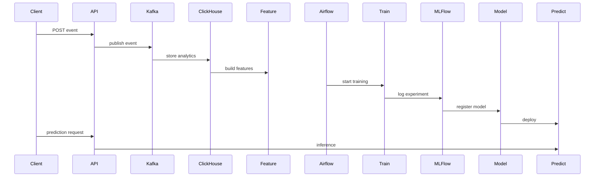

Dưới đây là **FULL ML PLATFORM ARCHITECTURE sau PHASE 2**.
Lúc này hệ thống đã chuyển từ **single-node docker → production platform chạy trên Kubernetes (k3s)**, có đầy đủ:

* Ingress
* API layer
* Streaming
* Feature Store
* ML lifecycle
* Observability
* Automation

Đây gần giống kiến trúc **ML Platform ở các công ty công nghệ thật** (simplified).

---

# 🧠 ML Platform Architecture — Phase 2



---

# ☸ Kubernetes Layer

Sau Phase 2 toàn bộ hệ thống chạy trong **k3s cluster**.



---

# 🔄 End-to-End Data Flow

Đây là **luồng dữ liệu hoàn chỉnh của platform**.



---

# 🧩 Platform Components (Phase 2)

| Layer               | Technology       |
| ------------------- | ---------------- |
| Ingress             | NGINX Ingress    |
| API                 | FastAPI          |
| Streaming           | Kafka            |
| OLTP                | PostgreSQL       |
| Analytics           | ClickHouse       |
| Feature Store       | Feature Table    |
| Orchestration       | Airflow          |
| Experiment Tracking | MLFlow           |
| Model Serving       | FastAPI / Bento  |
| Metrics             | Prometheus       |
| Dashboard           | Grafana          |
| Logs                | Loki             |
| Orchestration       | Kubernetes (k3s) |

---

# 📊 Kiến trúc Logical

```
                Internet
                    │
                    ▼
               Ingress
                    │
                    ▼
                  API
                    │
                    ▼
                 Kafka
            ┌───────────────┐
            │               │
            ▼               ▼
        PostgreSQL     ClickHouse
                            │
                            ▼
                       Feature Store
                            │
                            ▼
                         Airflow
                            │
                            ▼
                         Training
                            │
                            ▼
                          MLFlow
                            │
                            ▼
                        Model API
                            │
                            ▼
                         Prediction
```

---

# 🎯 Sau PHASE 2 bạn có gì

Bạn đã build được **một ML platform production-like** gồm:

```
Event streaming
Feature engineering
Training pipeline
Experiment tracking
Model registry
Model serving
Observability
Automation
Kubernetes deployment
```

Level này tương đương:

```
Mid → Senior ML Engineer
ML Platform Engineer
MLOps Engineer
```

---

# 🚀 Bước tiếp theo cực quan trọng (PHASE 3)

Phase 3 mới là phần **điên rồ nhất** của roadmap.

Bạn sẽ build:

```
AI Agents quản lý ML Platform
```

Ví dụ:

* Drift Detection Agent
* Auto Retrain Agent
* Cost Optimization Agent
* Incident Investigation Agent
* Deployment Decision Agent

Tức là:

```
AI vận hành AI system
```


Dưới đây là **Breakdown PHASE 2 (Month 4–6)** theo đúng nguyên tắc bạn yêu cầu:

* **Lý thuyết → áp dụng ngay**
* **Học cái gì thì triển khai cái đó vào hệ thống Phase 1**
* **3h/ngày**
* **Mỗi tháng có mini-project production**

Phase 2 chính là giai đoạn **từ “engineer biết làm” → “production engineer thực thụ”**.

---

# 🟦 PHASE 2 — PRODUCTION ENGINEERING (Month 4–6)

> Mục tiêu: biến ML Platform Phase 1 thành **production-grade system**

---

# 📆 MONTH 4 — Observability & Reliability

## 🎯 Mục tiêu tháng

Biến hệ thống thành **observable system**:

* biết **đang chạy ra sao**
* biết **khi nào lỗi**
* biết **lỗi ở đâu**
* biết **ảnh hưởng tới ai**

---

# Tuần 1 — Observability Foundation

## 📚 Lý thuyết

### 1️⃣ Three Pillars of Observability

| Pillar  | Purpose          |
| ------- | ---------------- |
| Metrics | đo performance   |
| Logs    | debug chi tiết   |
| Traces  | theo dõi request |

Bạn sẽ implement:

```
Metrics → Prometheus
Logs → Loki
Dashboard → Grafana
```

---

### 2️⃣ Metrics Design

Hiểu các loại metric:

| Metric    | Ví dụ         |
| --------- | ------------- |
| Counter   | request_count |
| Gauge     | active_users  |
| Histogram | latency       |

---

### 🛠 Thực hành

Cài stack:

```
Prometheus
Grafana
Node Exporter
```

Thêm metrics cho:

```
FastAPI
Kafka
ClickHouse
Postgres
```

---

### 🎯 Kết quả tuần 1

Dashboard hiển thị:

```
API request rate
API latency
Kafka lag
DB connection
CPU RAM
```

---

# Tuần 2 — Logging System

## 📚 Lý thuyết

### Logging Strategy

Production logs cần:

```
structured logs
json format
correlation id
request id
```

Ví dụ:

```json
{
 "timestamp": "...",
 "service": "api",
 "level": "error",
 "message": "db timeout",
 "request_id": "abc123"
}
```

---

### Log pipeline

```
App
 ↓
Promtail
 ↓
Loki
 ↓
Grafana
```

---

### 🛠 Thực hành

Cài:

```
Loki
Promtail
```

Logs collect từ:

```
FastAPI
Kafka
Airflow
ML pipeline
```

---

### 🎯 Kết quả tuần 2

Grafana có thể:

```
search logs
filter errors
trace request
```

---

# Tuần 3 — Alerting + Health Check

## 📚 Lý thuyết

### Alerting Strategy

Alert khi:

```
API latency > 2s
Kafka lag > threshold
DB connection fail
Model prediction error
```

---

### Health Probes

Có 3 loại:

| Probe     | Meaning             |
| --------- | ------------------- |
| liveness  | container sống      |
| readiness | container sẵn sàng  |
| startup   | container khởi động |

---

### 🛠 Thực hành

Viết endpoint:

```
/health
/ready
/metrics
```

Cài alert rules:

```
Prometheus AlertManager
```

---

### 🎯 Kết quả tuần 3

Hệ thống:

```
tự gửi alert
khi service lỗi
```

---

# Tuần 4 — Chaos & Incident Handling

## 📚 Lý thuyết

### Chaos Engineering

Test failure:

```
kill kafka
kill db
kill api
```

---

### Incident Handling

Incident template:

```
Incident ID
Root cause
Impact
Fix
Prevention
```

---

### 🛠 Thực hành

Simulation:

```
docker stop kafka
```

Xem:

```
alert
logs
metrics
```

---

### 🎯 Mini Project Month 4

Xây dashboard:

```
ML Platform Observability
```

Bao gồm:

```
API metrics
Kafka metrics
DB metrics
Model metrics
```

---

# 📆 MONTH 5 — Orchestration & Automation

> Biến ML system thành **tự vận hành**

---

# Tuần 1 — Airflow Production

## 📚 Lý thuyết

### Workflow Orchestration

ML pipeline:

```
data → feature → train → evaluate → deploy
```

Airflow concepts:

| Concept  | Meaning        |
| -------- | -------------- |
| DAG      | workflow       |
| Task     | step           |
| Operator | execution unit |

---

### 🛠 Thực hành

Cài:

```
Airflow
```

DAG:

```
daily_training_pipeline
```

---

# Tuần 2 — Feature Engineering Pipeline

## 📚 Lý thuyết

Feature Store concept:

```
raw events
 ↓
feature transform
 ↓
training dataset
```

---

### 🛠 Thực hành

Pipeline:

```
ClickHouse
 ↓
Feature script
 ↓
dataset parquet
```

---

### 🎯 Kết quả

Dataset tự generate mỗi ngày.

---

# Tuần 3 — Model Lifecycle Automation

## 📚 Lý thuyết

ML lifecycle:

```
train
evaluate
register
deploy
monitor
```

---

### 🛠 Thực hành

Airflow DAG:

```
train_model
evaluate_model
register_model
deploy_model
```

---

### Deploy strategy

```
shadow deployment
```

---

# Tuần 4 — CI/CD Advanced

## 📚 Lý thuyết

CI/CD pipeline:

```
build
test
lint
docker build
deploy
rollback
```

---

### 🛠 Thực hành

GitHub Actions:

```
push → build docker
push → deploy
fail → rollback
```

---

### 🎯 Mini Project Month 5

Pipeline:

```
New data
 ↓
Auto training
 ↓
Auto evaluation
 ↓
Auto deploy
```

---

# 📆 MONTH 6 — Scaling & Optimization

---

# Tuần 1 — Kubernetes (k3s)

## 📚 Lý thuyết

Kubernetes core:

| Concept    | Meaning         |
| ---------- | --------------- |
| Pod        | container group |
| Service    | networking      |
| Deployment | scaling         |

---

### 🛠 Thực hành

Cài:

```
k3s
```

Deploy:

```
FastAPI
Kafka
ML API
```

---

# Tuần 2 — Horizontal Scaling

## 📚 Lý thuyết

Scale strategies:

```
API scale
consumer scale
model scale
```

---

### 🛠 Thực hành

Scale:

```
3 API pods
2 consumer pods
```

---

# Tuần 3 — Load Testing

## 📚 Lý thuyết

Performance metrics:

```
RPS
Latency
Error rate
```

Tools:

```
k6
locust
```

---

### 🛠 Thực hành

Test:

```
10k requests/min
```

---

# Tuần 4 — Cost Optimization

## 📚 Lý thuyết

Cost drivers:

```
CPU
Storage
Network
Inference
```

---

### 🛠 Thực hành

Profiling:

```
py-spy
top
htop
```

---

### 🎯 Mini Project Month 6

Deploy scalable system:

```
k3s cluster
load tested
auto deploy
observability
```

---

# 🧠 Sau PHASE 2 bạn đạt level gì

Bạn sẽ có hệ thống:

```
API
Streaming
ML
Observability
Automation
Scaling
```

Tức là:

```
Production ML Platform Engineer
```

---

# 📊 Skill Tree đạt được

```
Data Engineering
   ├── Kafka
   ├── ClickHouse

ML Ops
   ├── MLFlow
   ├── Airflow
   ├── Model serving

Platform Engineering
   ├── Docker
   ├── Kubernetes
   ├── CI/CD

Observability
   ├── Prometheus
   ├── Grafana
   ├── Loki
```

---

# 🚀 Bước tiếp theo cực quan trọng

Nếu bạn muốn, tôi sẽ vẽ tiếp:

### **FULL ML PLATFORM ARCHITECTURE sau PHASE 2**

Nó sẽ giống **architecture của các công ty ML lớn**:

```
Ingress
API
Kafka
Feature Store
Airflow
MLFlow
Model Serving
Prometheus
Grafana
Kubernetes
```

Sơ đồ này cực quan trọng vì:

* bạn sẽ **build đúng system design**
* sau này **interview ML engineer cực dễ đậu**.
