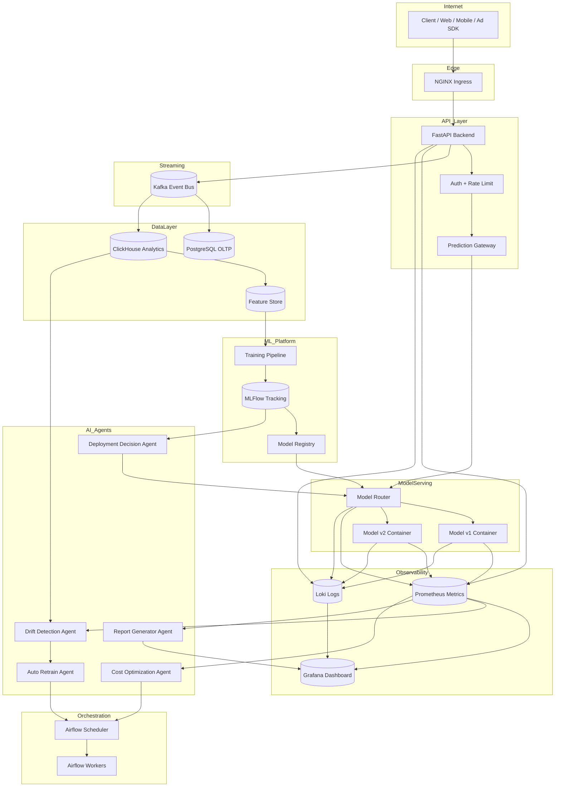
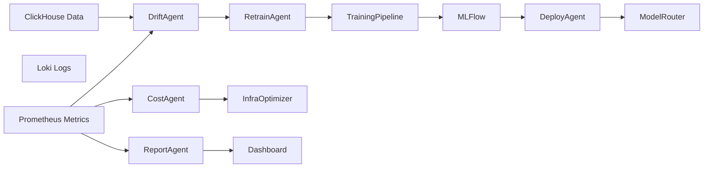
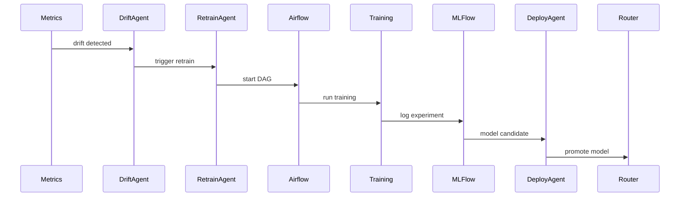
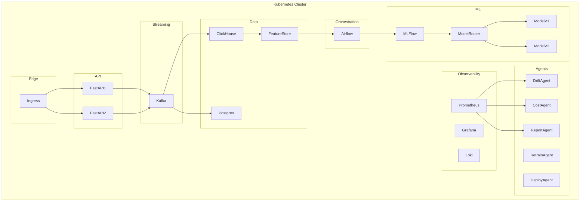

Dưới đây là **FULL AI-DRIVEN ML PLATFORM ARCHITECTURE (sau PHASE 3)**.
Lúc này hệ thống không chỉ **train + serve model** nữa, mà có thêm **AI Agents quan sát và tự vận hành platform**.

Kiến trúc có 4 tầng lớn:

1. **User & API Layer**
2. **Data & Streaming Layer**
3. **ML Lifecycle Layer**
4. **AI Agent Control Layer**

---

# 🧠 FULL AI-DRIVEN ML PLATFORM ARCHITECTURE



---

# 🧠 Kiến trúc logic của **AI Agent Layer**

AI Agents đóng vai trò như **SRE + ML Engineer tự động**.



---

# 🤖 Agent Responsibilities

| Agent                 | Vai trò              |
| --------------------- | -------------------- |
| Drift Detection Agent | phát hiện data drift |
| Auto Retrain Agent    | trigger training     |
| Deployment Agent      | promote model        |
| Cost Agent            | tối ưu CPU/RAM       |
| Report Agent          | tạo report system    |

---

# 🔄 Autonomous ML Lifecycle

Chu trình AI tự vận hành:



---

# ☸ Kubernetes Deployment Layout

Sau PHASE 3 toàn bộ platform chạy trên **k3s cluster**.



---

# 🎯 Sau PHASE 3 bạn đã build được

Một **AI-Driven ML Platform** có khả năng:

```text
Real-time data ingestion
Streaming analytics
Feature engineering
Model training pipeline
Experiment tracking
Model registry
Multi-model serving
Traffic routing
A/B testing
Drift detection
Auto retraining
Auto deployment
Cost optimization
System observability
AI agents controlling system
```

---

# 🚀 Level kiến thức bạn đạt được

Sau roadmap này bạn có thể làm:

| Role                       | Level  |
| -------------------------- | ------ |
| ML Platform Engineer       | Senior |
| MLOps Engineer             | Senior |
| ML Systems Engineer        | Senior |
| AI Infrastructure Engineer | Senior |

---

💡 Nếu bạn muốn, bước tiếp theo rất quan trọng là:

**Thiết kế Example Project chạy trên toàn bộ platform này**
(một hệ thống **AI Ads Prediction / Recommendation System**) — đúng kiểu project mà các công ty Big Tech dùng.

---
---

Dưới đây là **Breakdown PHASE 3 (Month 7–9)** theo đúng triết lý của toàn roadmap:

* **Lý thuyết → triển khai ngay vào platform**
* **Học cái gì → gắn vào hệ thống đang chạy**
* **3h/ngày**
* **Mỗi tháng có demo production**

PHASE 3 là giai đoạn chuyển từ:

> **ML Platform Engineer → AI Systems Architect**

---

# 🟦 PHASE 3 — ADVANCED + AI AGENT LAYER (Month 7–9)

> Xây hệ thống **AI vận hành AI**

---

# 📆 MONTH 7 — Multi-Model Platform

## 🎯 Mục tiêu tháng

ML Platform có khả năng:

```
deploy nhiều model
routing traffic
so sánh model
tự phát hiện model kém
```

Platform chuyển từ:

```
Single Model System
```

thành

```
Experiment-driven ML Platform
```

---

# Tuần 1 — Multi-Model Serving

## 📚 Lý thuyết

### Model Serving Architecture

Một hệ thống production **không bao giờ chỉ có 1 model**.

Ví dụ:

| Model       | Purpose      |
| ----------- | ------------ |
| model_v1    | baseline     |
| model_v2    | experimental |
| model_light | fallback     |

---

### Serving Pattern

```
Client
   ↓
Prediction Gateway
   ↓
Model Router
   ↓
Model Container
```

---

### 🛠 Thực hành

Refactor **Model Serving API**.

Triển khai:

```
model-service
 ├── model_v1
 ├── model_v2
 └── router
```

Routing logic:

```
/predict?model=v1
/predict?model=v2
```

---

### 🎯 Kết quả tuần 1

Model API có thể:

```
serve multiple models
switch model instantly
```

---

# Tuần 2 — Traffic Routing

## 📚 Lý thuyết

### Traffic Control

Production ML cần:

```
10% traffic → model B
90% traffic → model A
```

để test model mới.

---

### Routing Strategy

| Strategy      | Description |
| ------------- | ----------- |
| random        | simple A/B  |
| user-hash     | consistent  |
| feature-based | advanced    |

---

### 🛠 Thực hành

Viết **Model Router**

Ví dụ:

```
hash(user_id) % 100
```

```
<10 → model_v2
>=10 → model_v1
```

---

### 🎯 Kết quả

Bạn có:

```
A/B testing infrastructure
```

---

# Tuần 3 — Drift Detection

## 📚 Lý thuyết

### Model Drift

Có 3 loại drift:

| Drift         | Meaning               |
| ------------- | --------------------- |
| Data drift    | dữ liệu thay đổi      |
| Feature drift | distribution thay đổi |
| Concept drift | relation thay đổi     |

---

### Detection Strategy

Phổ biến:

```
KS Test
Population Stability Index
Distribution monitoring
```

---

### 🛠 Thực hành

Pipeline:

```
ClickHouse data
 ↓
Feature stats
 ↓
Drift metrics
 ↓
Prometheus metrics
```

---

### 🎯 Kết quả

Dashboard hiển thị:

```
feature distribution
model accuracy
drift score
```

---

# Tuần 4 — Experiment Comparison

## 📚 Lý thuyết

ML platform cần:

```
compare models automatically
```

Metric ví dụ:

```
CTR prediction accuracy
AUC
Latency
Error rate
```

---

### 🛠 Thực hành

Viết service:

```
experiment-evaluator
```

Chức năng:

```
pull metrics
compare models
recommend winner
```

---

### 🎯 Mini Project Month 7

Xây:

```
Experiment-capable ML Platform
```

Có thể:

```
deploy 2 models
split traffic
compare performance
```

---

# 📆 MONTH 8 — AI Agent Orchestration

Đây là phần **khác biệt nhất** của roadmap.

---

# Tuần 1 — Agent Architecture

## 📚 Lý thuyết

Agent system gồm:

```
Observer
Decision
Action
```

Ví dụ:

```
metrics → agent → decision → trigger pipeline
```

---

### Agent Communication

Agents giao tiếp qua:

```
internal API
task queue
event bus
```

---

### 🛠 Thực hành

Xây **Agent Framework**

Service:

```
agent-core
```

Modules:

```
observer
decision
executor
```

---

# Tuần 2 — Drift Detection Agent

## 📚 Lý thuyết

Agent đọc:

```
Prometheus metrics
```

Nếu:

```
drift_score > threshold
```

→ trigger retraining.

---

### 🛠 Thực hành

Agent:

```
drift-agent
```

Workflow:

```
metrics
 ↓
detect drift
 ↓
call Airflow API
```

---

# Tuần 3 — Auto Retrain Agent

## 📚 Lý thuyết

Retraining pipeline:

```
collect data
train model
evaluate
deploy candidate
```

---

### 🛠 Thực hành

Agent:

```
retrain-agent
```

Trigger:

```
Airflow DAG
```

---

# Tuần 4 — Deployment Decision Agent

## 📚 Lý thuyết

Agent đọc:

```
experiment metrics
```

Nếu:

```
model_v2 better
```

→ promote model.

---

### 🛠 Thực hành

Agent:

```
deploy-agent
```

Action:

```
update router
```

---

### 🎯 Mini Project Month 8

Bạn có hệ thống:

```
AI agents managing ML pipeline
```

Agents:

```
drift agent
retrain agent
deploy agent
report agent
```

---

# 📆 MONTH 9 — Senior Hardening & Portfolio

Tháng này mục tiêu:

```
chuyển project → portfolio senior
```

---

# Tuần 1 — Architecture Refactor

## 📚 Lý thuyết

System design principles:

```
separation of concern
fault tolerance
observability
```

---

### 🛠 Thực hành

Refactor:

```
services
configs
naming
docker
k8s
```

---

# Tuần 2 — Documentation

## 📚 Lý thuyết

Engineer senior **được đánh giá qua documentation**.

Viết:

```
Architecture doc
Runbook
Deployment guide
```

---

### 🛠 Thực hành

Repo structure:

```
docs/
architecture/
runbooks/
incident/
```

---

# Tuần 3 — Failure Simulation

Test system:

```
Kafka crash
Model server crash
DB slow
```

---

### 🛠 Thực hành

Viết:

```
incident reports
postmortem
```

---

# Tuần 4 — Portfolio & Interview

Chuẩn bị:

```
GitHub repo
Architecture diagrams
README
Demo video
```

---

### Practice system design:

Ví dụ câu hỏi:

```
Design ML recommendation system
Design ad prediction system
Design fraud detection pipeline
```

---

# 🎯 Final Platform (After 9 Months)

Bạn sẽ có **AI-Driven ML Platform**.

```
Internet
   │
Ingress
   │
API
   │
Kafka
   │
ClickHouse / PostgreSQL
   │
Feature Store
   │
Airflow
   │
MLFlow
   │
Model Serving
   │
Experiment System
   │
AI Agents
```

---

# 📊 Final Skill Tree

Bạn sẽ master:

### Infrastructure

```
Docker
Kubernetes
Linux
Networking
```

### Data Engineering

```
Kafka
ClickHouse
Streaming
```

### ML Ops

```
MLFlow
Airflow
Experiment platform
```

### Platform Engineering

```
Observability
CI/CD
Scaling
```

### AI Systems

```
Agent architecture
Autonomous ML pipeline
```

---

# 🚀 Kết quả thực tế sau roadmap này

Bạn có thể apply các role:

```
ML Platform Engineer
MLOps Engineer
ML Systems Engineer
AI Infrastructure Engineer
```

---

Nếu bạn muốn, bước tiếp theo tôi có thể vẽ:

## 🧠 **FULL AI-DRIVEN ML PLATFORM ARCHITECTURE (Phase 3)**

Sơ đồ này là **level kiến trúc mà nhiều senior ML engineer còn chưa thiết kế được**.
