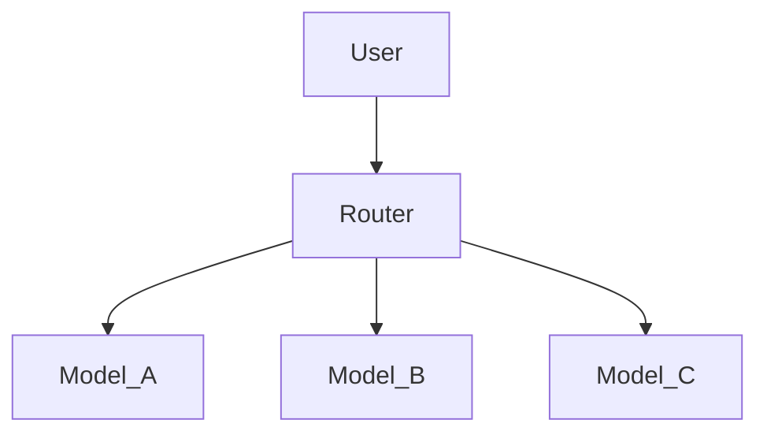
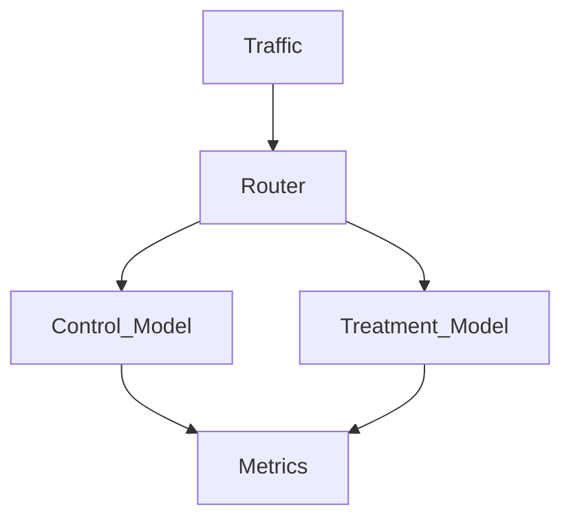
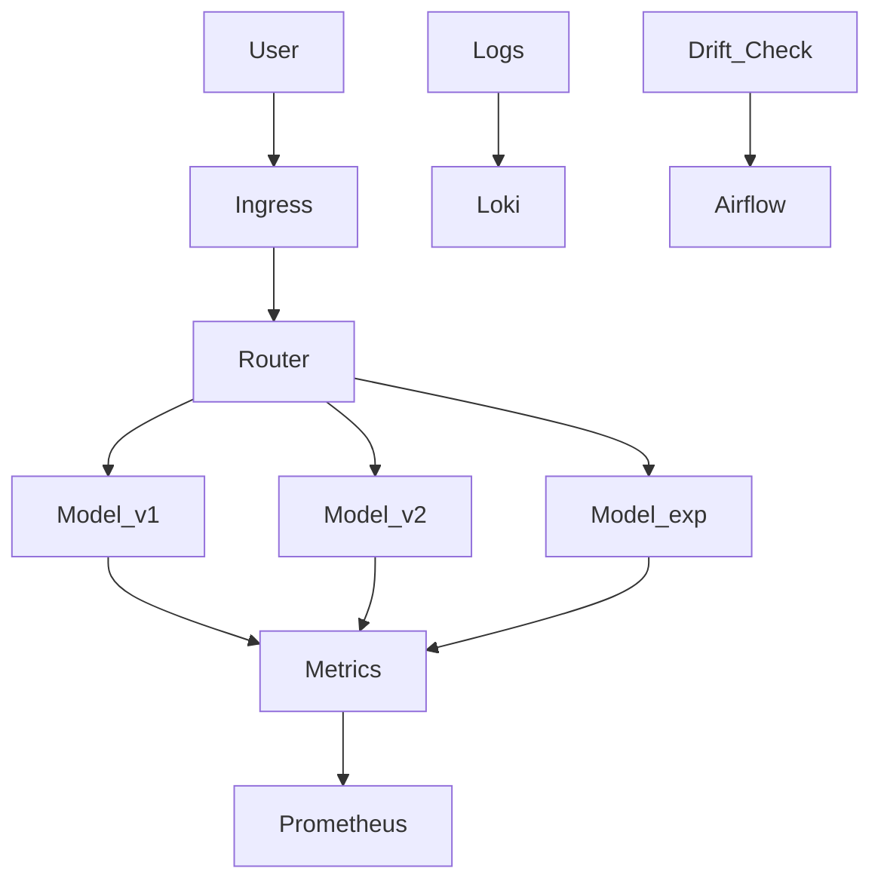
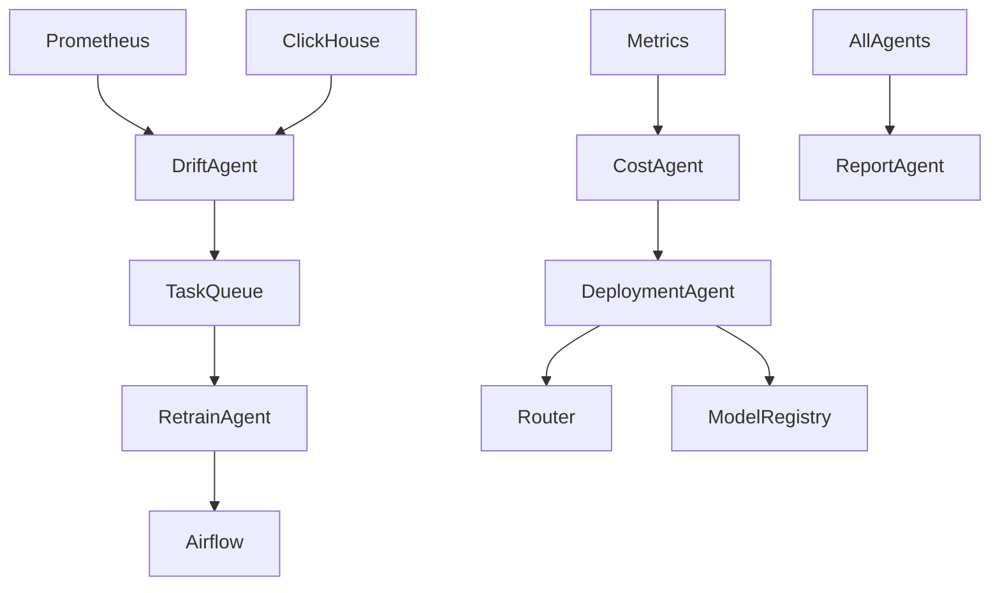

Month 7 là bước chuyển từ “1 model production”
→ “Model marketplace nội bộ”.

---

# 🟦 PHASE 3 — ADVANCED + AI AGENT LAYER (Month 7–9)

Mục tiêu phase này:

> Build system that manages itself.

---

# 📆 MONTH 7 — Multi-Model Platform

> Từ single-model serving → traffic-aware model ecosystem

---

# ✅ Strategic Focus — Phân tích chi tiết

---

## 1️⃣ Multiple Model Serving

Không còn:

```
/predict → 1 model
```

Mà phải có:

* Model v1
* Model v2
* Model experimental
* Model baseline
* Possibly rule-based fallback

Kiến trúc:



Phải có:

* Model registry integration
* Dynamic model loading
* Hot swap model
* Version-based routing

---

## 2️⃣ Traffic Routing

Thiết kế Router layer:

* Percentage split (80/20)
* User-segment based routing
* Random bucket routing
* Sticky session routing

Phải đảm bảo:

* Deterministic routing
* Reproducibility
* Log routing decision

Không log routing → không phân tích được A/B.

---

## 3️⃣ A/B Testing Infrastructure

Không phải chỉ split traffic.

Phải có:

* Experiment ID
* Control vs Treatment
* Metrics comparison
* Statistical threshold
* Auto winner selection (optional)

Flow:



Phải log:

* Prediction
* Latency
* Outcome (nếu có label)
* Experiment group

---

## 4️⃣ Drift Detection Logic

Ít nhất phải có:

* Feature distribution comparison
* Mean/variance drift
* KL divergence (basic)
* Prediction distribution shift

Có thể:

* Batch daily drift check
* Trigger retraining

Không drift detection → model chết âm thầm.

---

## 5️⃣ Experiment Comparison Automation

Airflow DAG hoặc service riêng:

* Compare experiment metrics
* Rank models
* Generate report
* Suggest promotion

Đây là bước gần với AI self-governance.

---

# 🧠 Architectural Principle — ĐÚNG HƯỚNG

> Model is replaceable
> Traffic is controllable
> Performance is measurable

Mình bổ sung:

* No model is sacred
* Routing is part of ML
* Experimentation is continuous

---

# 🏗 System Architecture After Month 7



Giờ bạn có:

* Multi-model serving
* Traffic split
* Drift detection
* Automated experiment evaluation

---

# 📦 Deliverables End of Month 7

* Router layer implemented
* 3 models running simultaneously
* A/B testing infra
* Drift detection script
* Experiment report automation
* Documentation

---

# 🎯 Outcome

Sau Month 7 bạn có:

✔ Multi-model platform
✔ Experiment-ready infra
✔ Traffic control
✔ Drift monitoring
✔ Auto comparison

Bạn đã build:

Mini Google ML Platform.

---

Month 8 sẽ là:

* Online Feature Store
* Real-time feature sync
* Low-latency inference optimization
* Caching strategy
* Vector DB integration (chuẩn bị AI Agent layer)

Month 9 sẽ là:

* AI Agent control layer
* Meta-controller agent
* Policy-based deployment
* Self-healing logic

---
---
---


Month 8 là lúc bạn chính thức bước vào:

> **System that manages itself.**

Không còn chỉ automation bằng DAG,
mà là **Agent-based decision system**.

---

# 📆 MONTH 8 — AI Agent Orchestration Layer

> Automation → Autonomy

---

# 🎯 Mục tiêu tháng

Xây một tầng meta-control phía trên ML platform:

* Agent quan sát metrics
* Agent ra quyết định
* Agent kích hoạt workflow
* Human chỉ duyệt khi rủi ro cao

Bạn đang xây một **AI SRE + AI ML-Ops layer**.

---

# 🧠 Strategic Focus — Phân tích sâu từng Agent

---

## 1️⃣ Drift Detection Agent

### Nhiệm vụ

* Query feature distribution
* So sánh với baseline
* Tính drift score
* Gửi cảnh báo hoặc trigger retrain

### Input

* Prometheus metrics
* Feature stats từ ClickHouse
* Prediction logs

### Output

* Drift event
* Severity level
* Suggested action

---

## 2️⃣ Auto Retrain Agent

Không chỉ dựa vào schedule.

### Trigger khi:

* Drift vượt threshold
* Performance drop
* Cost efficiency thay đổi
* Canary thất bại

### Agent sẽ:

* Gửi task vào queue
* Kích hoạt Airflow retraining DAG
* Theo dõi kết quả
* Đánh giá model mới

---

## 3️⃣ Cost Analyzer Agent

Đây là điểm rất mạnh.

### Theo dõi:

* Cost per prediction
* Infra cost growth
* CPU waste
* Overprovisioning

### Có thể đề xuất:

* Scale down
* Batch inference
* Quantization
* Change instance type

Bạn đang build AI FinOps layer.

---

## 4️⃣ Deployment Decision Agent

Agent này đóng vai ML Platform Architect.

### Nó sẽ:

* So sánh experiment metrics
* Kiểm tra drift
* Kiểm tra latency
* Kiểm tra cost impact
* Đưa ra quyết định:

  * Promote
  * Canary
  * Reject
  * Rollback

Human chỉ duyệt nếu:

* Risk level = high
* Production impact > threshold

---

## 5️⃣ Report Generator Agent

Agent này:

* Tạo weekly ML health report
* Tóm tắt experiment
* Phân tích drift
* Phân tích cost
* Xuất markdown hoặc PDF

Đây là AI làm việc thay bạn.

---

# 🏗 Agent Interaction Architecture



---

# 🧩 Internal Communication

Bạn phải có:

* Internal API (FastAPI)
* Message Queue (Redis / Kafka topic riêng)
* Agent state store
* Decision log database

---

# 🔐 Governance Layer

Mỗi action phải có:

* Reason
* Confidence score
* Impact estimation
* Rollback plan

Không có decision log → không audit được.

---

# 🧠 Architectural Principle — ĐÚNG HƯỚNG

> Agents observe metrics
> Agents trigger workflows
> Human approves only high-risk actions

Mình bổ sung:

* Every agent decision must be explainable
* No silent automation
* Autonomy with boundaries

---

# 📦 Deliverables End of Month 8

* 5 running agents
* Internal API
* Task queue integration
* Decision log store
* Human approval interface (basic)
* Weekly auto report

---

# 🎯 Outcome

Sau Month 8 bạn có:

✔ AI giám sát ML system
✔ AI trigger retrain
✔ AI phân tích cost
✔ AI đề xuất deploy
✔ AI viết báo cáo

Bạn đã build:

Mini autonomous ML Ops platform.

---

Month 9 sẽ là bước cuối của Phase 3:

* Self-healing infra
* Policy engine
* Meta-controller agent
* Risk scoring system
* Autonomous rollback
* Safety guardrail layer

---


Đây là tháng “đóng dấu đẳng cấp”.

Nếu Month 1–8 là xây hệ thống,
thì Month 9 là:

> Chứng minh bạn **thực sự hiểu hệ thống**.

Đây là bước chuyển từ Builder → Senior.

---

# 📆 MONTH 9 — Senior-Level Hardening & Portfolio

> You don’t just build systems.
> You defend them.

---

# 🎯 Strategic Focus — Phân tích từng phần

---

## 1️⃣ Full Architecture Refactor

Sau 8 tháng, chắc chắn có:

* Coupling thừa
* Component dư thừa
* Dockerfile chưa tối ưu
* Naming chưa chuẩn
* Monitoring chưa nhất quán

Month 9 phải:

* Review toàn bộ repo
* Chuẩn hóa structure
* Tách domain layer rõ ràng
* Clean CI/CD
* Remove technical debt
* Update diagrams vFinal

Đây là lần “architectural maturity pass”.

---

## 2️⃣ FAANG-Style Design Document

Bạn phải viết 1 tài liệu kiểu:

* Problem statement
* Constraints
* Non-functional requirements
* Traffic assumptions
* Scaling strategy
* Failure scenarios
* Cost estimation
* Trade-off analysis
* Alternatives considered

Nếu không viết được document này → chưa phải senior.

---

## 3️⃣ Postmortem Sample

Giả lập sự cố:

* Model deploy sai
* Drift không phát hiện
* Kafka backlog
* Cost spike

Viết:

* Timeline
* Impact
* Root cause
* What went wrong
* What went well
* Action items

Đây là kỹ năng rất hiếm.

---

## 4️⃣ Load Simulation Scenario

Tạo kịch bản:

* 10x traffic
* Region outage
* DB slow response
* High concurrency inference

Viết báo cáo:

* Bottleneck
* Scaling behavior
* Cost impact
* Lessons learned

---

## 5️⃣ GitHub Clean-up

Phải có:

* README chuẩn
* Architecture diagram
* Setup guide
* Folder clean
* Commit history có ý nghĩa
* No random file

GitHub của bạn phải nhìn như production repo.

---

## 6️⃣ Production-Grade Documentation

Tối thiểu phải có:

* System overview
* Infra diagram
* Data flow
* ML lifecycle
* Agent orchestration
* Observability guide
* Deployment guide
* Incident handling
* Scaling strategy
* Cost model

Documentation là bằng chứng.

---

## 7️⃣ Mock System Design Practice

Bạn phải tự trả lời được:

* Thiết kế hệ thống ads tracking 1B events/day
* Thiết kế ML platform multi-model
* Thiết kế A/B testing infra
* Thiết kế drift detection system
* Thiết kế autonomous retrain pipeline

Và nói trôi chảy trong 45 phút.

---

# 🧠 Architectural Principle — RẤT ĐÚNG

> Engineer who can explain system wins
> Documentation = proof of mastery

Mình bổ sung:

* Clarity > Complexity
* Trade-offs define seniority

---

# 🏗 Final Architecture Snapshot

Sau Month 9 bạn có:

* Kafka ingestion
* ClickHouse analytics
* MLflow lifecycle
* Airflow orchestration
* Canary deployment
* Drift detection
* Agent-based governance
* Kubernetes scaling
* Observability stack
* Cost-aware design
* Self-healing logic

Đây không còn là project.
Đây là một ML Platform hoàn chỉnh.

---

# 📦 Deliverables End of Month 9

* Clean GitHub repo
* 1 FAANG-style design doc (~20–30 pages)
* 1 Postmortem document
* 1 Load test report
* Updated architecture diagram vFinal
* Portfolio-ready project

---

# 🎯 Outcome

Sau Month 9 bạn là:

✔ ML Platform Engineer
✔ Production Systems Engineer
✔ System Design capable
✔ Autonomous ML infra builder
✔ Portfolio strong enough for senior interviews

---

# 🏁 KẾT THÚC PHASE 3

Bạn đã đi từ:

Month 1 → Single backend
Month 9 → Autonomous ML platform with AI agents

---

Bây giờ theo đúng phương pháp bạn đặt ra ban đầu:

Ta đã hoàn thành cấp:

✔ Phase
✔ Month
