Rất hợp lý. Với mục tiêu **bootcamp quân đội + vừa chắc lý thuyết vừa giỏi thực hành**, chúng ta cần một **repository structure đủ kỷ luật** để:

* học
* thực hành
* vận hành hệ thống thật
* viết tài liệu chuẩn production

Tôi sẽ thiết kế **repository cho toàn bộ 9 tháng**, nhưng **Month 1 sẽ là phần được dùng ngay**.

---
---


Dưới đây là **Repository Architecture Diagram** cho toàn bộ project `ai-ml-platform-bootcamp`.

Sơ đồ này giúp nhìn **1 phát hiểu ngay repo này hoạt động như thế nào**:

* Bootcamp tài liệu → hướng dẫn học
* Platform code → hệ thống thực tế
* Deployments → chạy production
* Tools → test hệ thống
* Experiments → nghiên cứu ML
* Docs → kiến trúc & vận hành

---

# 🧠 Repository Architecture Diagram

```mermaid
flowchart TB

subgraph Learning_Layer["Bootcamp Learning Layer"]
BOOTCAMP[bootcamp/]
M1[Month1 Production Infra]
M2[Month2 Data Ingestion]
M3[Month3 Streaming]
M4[Month4 Observability]
M5[Month5 ML Training]
M6[Month6 MLOps Platform]
M7[Month7 Multi Model]
M8[Month8 AI Agents]
M9[Month9 Senior Hardening]

BOOTCAMP --> M1
BOOTCAMP --> M2
BOOTCAMP --> M3
BOOTCAMP --> M4
BOOTCAMP --> M5
BOOTCAMP --> M6
BOOTCAMP --> M7
BOOTCAMP --> M8
BOOTCAMP --> M9
end


subgraph Documentation["System Documentation"]
DOCS[docs/]
ARCH[architecture]
DIAGRAMS[diagrams]
DECISIONS[ADR decisions]
RUNBOOKS[runbooks]
POSTMORTEMS[postmortems]

DOCS --> ARCH
DOCS --> DIAGRAMS
DOCS --> DECISIONS
DOCS --> RUNBOOKS
DOCS --> POSTMORTEMS
end


subgraph Platform["ML Platform Implementation"]
PLATFORM[platform/]

INFRA[infra]
GATEWAY[gateway nginx]
BACKEND[backend fastapi]
STREAMING[kafka streaming]
MLSERVICES[ml services]
AGENTS[ai agents]
OBSERVABILITY[prometheus grafana]

PLATFORM --> INFRA
PLATFORM --> GATEWAY
PLATFORM --> BACKEND
PLATFORM --> STREAMING
PLATFORM --> MLSERVICES
PLATFORM --> AGENTS
PLATFORM --> OBSERVABILITY
end


subgraph Research["ML Experiments"]
EXP[experiments/]

NOTEBOOKS[jupyter notebooks]
PROTOTYPES[ml prototypes]

EXP --> NOTEBOOKS
EXP --> PROTOTYPES
end


subgraph Operations["Engineering Tools"]
TOOLS[tools/]

LOADTEST[load testing]
SCRIPTS[automation scripts]
BENCH[benchmarking]

TOOLS --> LOADTEST
TOOLS --> SCRIPTS
TOOLS --> BENCH
end


subgraph Deployment["Deployment Layer"]
DEPLOY[deployments/]

DOCKER[docker compose]
STACK[ml platform stack]
K8S[kubernetes manifests]

DEPLOY --> DOCKER
DEPLOY --> STACK
DEPLOY --> K8S
end


BOOTCAMP --> PLATFORM
PLATFORM --> DEPLOY
PLATFORM --> TOOLS
PLATFORM --> EXP
DOCS --> PLATFORM
DOCS --> DEPLOY
```



---

# 📊 Ý nghĩa của từng Layer

## 1️⃣ Bootcamp Layer

Đây là **nội dung học**.

Bạn học:

```
theory
→ lab
→ project
→ production system
```

---

## 2️⃣ Documentation Layer

Dành cho **engineering thinking**

Có:

* Architecture docs
* ADR (Architecture Decision Record)
* Runbook
* Postmortem

=> Đây là thứ **Senior Engineer luôn viết**.

---

## 3️⃣ Platform Layer

Đây là **core system bạn build**.

```
API
Streaming
ML pipeline
Agents
Monitoring
```

---

## 4️⃣ Research Layer

Nơi thử nghiệm:

```
feature engineering
model experiments
prototypes
```

---

## 5️⃣ Tools Layer

Engineering tools:

```
load testing
benchmark
automation
```

---

## 6️⃣ Deployment Layer

Chạy production:

```
Docker Compose
Kubernetes
```

---

# 🔥 Điều đặc biệt của repo này

Repo này không phải:

```
machine-learning-project
```

mà là:

```
ML PLATFORM ENGINEERING REPOSITORY
```

Giống repo của:

* Uber Michelangelo
* Netflix ML Platform
* Meta ML Infra

---

# 🚀 Nếu làm đúng repo này sau 9 tháng

Bạn sẽ có portfolio:

```
AI ML Platform Engineer
```

không phải:

```
Junior Data Scientist
```


---
---

# 🧠 MASTER GUIDELINE (TOÀN KHÓA)

Mọi nội dung trong repo phải tuân thủ 5 nguyên tắc:

### 1️⃣ Theory → Practice → System

Không học lý thuyết suông.

Mỗi concept phải đi qua:

```
Concept
→ Lab
→ System Integration
```

---

### 2️⃣ Bootcamp Discipline

Mọi module phải có:

```
Goal
Theory
Hands-on Lab
Mini Project
Checklist
```

---

### 3️⃣ Production Mindset

Không có:

```
toy project
hello world demo
```

Mọi thứ phải là:

```
deployable
observable
maintainable
```

---

### 4️⃣ Documentation First

Không có tài liệu = không tính là học.

Mọi module phải có:

```
Architecture
Notes
Operational knowledge
```

---

### 5️⃣ Military Structure

Repository phải **rõ ràng, không rối**.

---


# 🧠 FULL REPOSITORY STRUCTURE

`ai-ml-platform-bootcamp`

```text
ai-ml-platform-bootcamp/
│
├── README.md
├── ROADMAP.md
├── BOOTCAMP_RULES.md
├── SYSTEM_ARCHITECTURE.md
├── DEVELOPMENT_WORKFLOW.md
├── TECH_STACK.md
├── SECURITY_GUIDELINES.md
│
├── docs/
│   │
│   ├── architecture/
│   │   ├── ml-platform-overview.md
│   │   ├── event-driven-architecture.md
│   │   ├── data-flow.md
│   │   └── component-breakdown.md
│   │
│   ├── diagrams/
│   │   ├── phase1-architecture.mmd
│   │   ├── phase2-architecture.mmd
│   │   ├── phase3-architecture.mmd
│   │   ├── kafka-stream-flow.mmd
│   │   ├── ml-training-pipeline.mmd
│   │   └── ai-agent-architecture.mmd
│   │
│   ├── decisions/
│   │   ├── ADR-001-docker-first.md
│   │   ├── ADR-002-event-driven-design.md
│   │   ├── ADR-003-kafka-over-rabbitmq.md
│   │   ├── ADR-004-clickhouse-for-analytics.md
│   │   └── ADR-005-mlflow-model-registry.md
│   │
│   ├── postmortems/
│   │   ├── incident-template.md
│   │   ├── kafka-overload-simulation.md
│   │   └── model-drift-case-study.md
│   │
│   └── runbooks/
│       ├── service-deployment.md
│       ├── kafka-recovery.md
│       ├── database-backup.md
│       └── model-rollback.md
│
├── bootcamp/
│   │
│   ├── README.md
│   │
│   ├── month1-production-infra/
│   │   ├── README.md
│   │   ├── ROADMAP.md
│   │   ├── SPRINT1-production-server.md
│   │   ├── SPRINT2-backend-core.md
│   │   │
│   │   ├── theory/
│   │   │   ├── linux-production-basics.md
│   │   │   ├── ssh-security.md
│   │   │   ├── docker-architecture.md
│   │   │   ├── reverse-proxy-nginx.md
│   │   │   ├── tls-https-fundamentals.md
│   │   │   └── postgres-architecture.md
│   │   │
│   │   ├── labs/
│   │   │   ├── lab01-linux-server-setup.md
│   │   │   ├── lab02-ssh-hardening.md
│   │   │   ├── lab03-docker-installation.md
│   │   │   ├── lab04-nginx-reverse-proxy.md
│   │   │   ├── lab05-https-certbot.md
│   │   │   ├── lab06-fastapi-container.md
│   │   │   └── lab07-postgres-schema.md
│   │   │
│   │   └── projects/
│   │       └── ad-impression-api.md
│   │
│   ├── month2-data-ingestion/
│   │   ├── README.md
│   │   ├── kafka-basics.md
│   │   ├── event-schema-design.md
│   │   └── ingestion-pipeline-labs.md
│   │
│   ├── month3-stream-processing/
│   │   ├── README.md
│   │   ├── stream-processing-theory.md
│   │   ├── kafka-consumers.md
│   │   └── clickhouse-ingestion.md
│   │
│   ├── month4-observability/
│   │   ├── README.md
│   │   ├── prometheus-metrics.md
│   │   ├── grafana-dashboards.md
│   │   └── loki-logging.md
│   │
│   ├── month5-ml-training/
│   │   ├── README.md
│   │   ├── feature-engineering.md
│   │   ├── ml-training-pipeline.md
│   │   └── experiment-tracking.md
│   │
│   ├── month6-mlops-platform/
│   │   ├── README.md
│   │   ├── mlflow-server.md
│   │   ├── model-registry.md
│   │   └── automated-training.md
│   │
│   ├── month7-multi-model-serving/
│   │   ├── README.md
│   │   ├── ab-testing.md
│   │   └── traffic-routing.md
│   │
│   ├── month8-ai-agent-layer/
│   │   ├── README.md
│   │   ├── agent-architecture.md
│   │   ├── drift-detection-agent.md
│   │   ├── retrain-agent.md
│   │   └── cost-optimizer-agent.md
│   │
│   └── month9-senior-hardening/
│       ├── README.md
│       ├── architecture-refactor.md
│       ├── system-design.md
│       └── portfolio-preparation.md
│
├── platform/
│   │
│   ├── infra/
│   │   ├── dockerfiles/
│   │   │   ├── fastapi.Dockerfile
│   │   │   ├── kafka.Dockerfile
│   │   │   └── airflow.Dockerfile
│   │   │
│   │   └── terraform/
│   │       └── infrastructure.tf
│   │
│   ├── gateway/
│   │   ├── nginx.conf
│   │   └── routing.conf
│   │
│   ├── backend/
│   │   ├── app/
│   │   │   ├── main.py
│   │   │   ├── api/
│   │   │   ├── services/
│   │   │   ├── models/
│   │   │   └── config/
│   │   │
│   │   └── requirements.txt
│   │
│   ├── streaming/
│   │   ├── producers/
│   │   ├── consumers/
│   │   └── schemas/
│   │
│   ├── ml-services/
│   │   ├── training/
│   │   ├── feature-store/
│   │   └── serving/
│   │
│   ├── agents/
│   │   ├── drift-agent/
│   │   ├── retrain-agent/
│   │   ├── deployment-agent/
│   │   └── cost-agent/
│   │
│   └── observability/
│       ├── prometheus.yml
│       ├── grafana-dashboards.json
│       └── loki-config.yml
│
├── experiments/
│   ├── notebooks/
│   │   ├── feature-engineering.ipynb
│   │   └── model-evaluation.ipynb
│   │
│   └── prototypes/
│       ├── drift-detection-prototype.py
│       └── recommender-experiment.py
│
├── tools/
│   ├── load-testing/
│   │   └── locustfile.py
│   │
│   ├── benchmarking/
│   │   └── kafka-throughput-test.py
│   │
│   └── scripts/
│       ├── deploy.sh
│       ├── backup-db.sh
│       └── cleanup-logs.sh
│
└── deployments/
    ├── docker/
    │   ├── docker-compose-core.yml
    │   └── docker-compose-observability.yml
    │
    ├── compose/
    │   └── ml-platform-stack.yml
    │
    └── k8s/
        ├── api-deployment.yaml
        ├── kafka-cluster.yaml
        └── airflow-deployment.yaml
```

---

# 📊 FILE FUNCTION TABLE

## Root Files

| File                    | Purpose                                                      |
| ----------------------- | ------------------------------------------------------------ |
| README.md               | Giới thiệu project, mục tiêu bootcamp, kiến trúc ML platform |
| ROADMAP.md              | Lộ trình học 9 tháng                                         |
| BOOTCAMP_RULES.md       | Quy tắc kỷ luật bootcamp                                     |
| SYSTEM_ARCHITECTURE.md  | Mô tả kiến trúc toàn hệ thống                                |
| DEVELOPMENT_WORKFLOW.md | Quy trình dev, commit, deploy                                |
| TECH_STACK.md           | Danh sách toàn bộ công nghệ                                  |
| SECURITY_GUIDELINES.md  | Hướng dẫn bảo mật server và platform                         |

---

## Docs

| Folder            | Purpose                                |
| ----------------- | -------------------------------------- |
| docs/architecture | mô tả chi tiết các thành phần hệ thống |
| docs/diagrams     | sơ đồ Mermaid của hệ thống             |
| docs/decisions    | Architecture Decision Records          |
| docs/postmortems  | phân tích sự cố                        |
| docs/runbooks     | hướng dẫn vận hành hệ thống            |

---

## Bootcamp Curriculum

| Folder          | Purpose             |
| --------------- | ------------------- |
| bootcamp/month1 | infrastructure      |
| bootcamp/month2 | data ingestion      |
| bootcamp/month3 | streaming           |
| bootcamp/month4 | observability       |
| bootcamp/month5 | ML training         |
| bootcamp/month6 | ML Ops              |
| bootcamp/month7 | multi model serving |
| bootcamp/month8 | AI agent layer      |
| bootcamp/month9 | senior engineering  |

---

## Platform Code

| Folder                 | Purpose                 |
| ---------------------- | ----------------------- |
| platform/infra         | Dockerfiles + infra     |
| platform/gateway       | nginx gateway           |
| platform/backend       | FastAPI backend         |
| platform/streaming     | Kafka producer/consumer |
| platform/ml-services   | ML pipeline             |
| platform/agents        | AI automation agents    |
| platform/observability | monitoring stack        |

---

## Experiments

| Folder                 | Purpose           |
| ---------------------- | ----------------- |
| experiments/notebooks  | exploratory ML    |
| experiments/prototypes | prototype systems |

---

## Tools

| Folder             | Purpose            |
| ------------------ | ------------------ |
| tools/load-testing | API load testing   |
| tools/scripts      | automation scripts |
| tools/benchmarking | performance tests  |

---

## Deployments

| Folder              | Purpose              |
| ------------------- | -------------------- |
| deployments/docker  | docker compose stack |
| deployments/compose | full platform stack  |
| deployments/k8s     | Kubernetes manifests |

---

# 🧠 Vì sao kiến trúc repo này rất mạnh

Nó mô phỏng **repo của production ML platform**:

* curriculum
* system architecture
* platform code
* experiments
* operations
* deployment

Một recruiter nhìn repo này sẽ thấy:

> "Người này không chỉ biết ML, mà còn hiểu platform engineering."


---

# 📦 BOOTCAMP DIRECTORY STRUCTURE

Mỗi tháng có format giống nhau.

Ví dụ:

```
bootcamp/month1-production-infra/
```

```
month1-production-infra/
│
├── README.md
├── roadmap.md
│
├── part1-foundation/
├── part2-server-setup/
├── part3-backend-core/
└── part4-system-integration/
```

---

# 📚 BOOTCAMP CONTENT STRUCTURE

Ví dụ:

```
part2-server-setup/
```

```
part2-server-setup/
│
├── theory
│   ├── linux-production.md
│   ├── ssh-security.md
│   ├── firewall.md
│   └── docker-intro.md
│
├── labs
│   ├── lab1-server-provision.md
│   ├── lab2-security.md
│   ├── lab3-docker.md
│   └── lab4-nginx.md
│
├── project
│   └── sprint1-mini-project.md
│
└── checklist.md
```

---

# 🧩 PLATFORM SOURCE CODE STRUCTURE

Phần **code thật của hệ thống** nằm ở:

```
platform/
```

---

# INFRASTRUCTURE

```
platform/infra/
```

```
infra/
│
├── nginx
├── docker
├── firewall
└── certbot
```

---

# BACKEND

```
platform/backend/
```

```
backend/
│
├── api
├── services
├── models
├── schemas
├── config
└── main.py
```

---

# STREAMING

```
platform/streaming/
```

```
streaming/
│
├── kafka-producers
├── kafka-consumers
└── event-schemas
```

---

# ML SERVICES

```
platform/ml-services/
```

```
ml-services/
│
├── training
├── inference
├── feature-store
└── model-registry
```

---

# AI AGENTS

```
platform/agents/
```

```
agents/
│
├── drift-detector
├── retrain-agent
├── cost-analyzer
├── deploy-decision
└── report-generator
```

---

# OBSERVABILITY

```
platform/observability/
```

```
observability/
│
├── prometheus
├── grafana
├── logging
└── tracing
```

---

# 🧪 LOAD TESTING

```
tools/load-testing/
```

```
load-testing/
│
├── k6
├── locust
└── benchmark-results
```

---

# 🚀 DEPLOYMENTS

```
deployments/
```

```
deployments/
│
├── docker-compose
│
├── staging
│
└── production
```

---

# 🧠 MONTH 1 STRUCTURE (BOOTCAMP)

```
month1-production-infra/
```

```
month1-production-infra/
│
├── README.md
├── roadmap.md
│
├── part1-infrastructure-foundation
│
├── part2-production-server
│
├── part3-backend-core
│
└── part4-system-integration
```

---

# 🎖 BOOTCAMP DISCIPLINE RULES

Trong mỗi phần bắt buộc có:

```
1 theory
1 lab
1 checklist
1 mini project
```

---

# 📈 SKILL PROGRESSION

Month 1 xong bạn sẽ biết:

```
Linux production
Docker infrastructure
Reverse proxy
API backend
Database layer
```

---

# ⚠️ QUY TẮC GENERATE NỘI DUNG (THEO YÊU CẦU CỦA BẠN)

Bạn yêu cầu **một quy tắc rất đúng để tránh AI bị ngáo khi tài liệu dài**.

Vì vậy format sẽ là:

---

# FORMAT GENERATION

### 1️⃣ Mỗi phần bắt đầu bằng

```
GUIDELINE OF THIS SECTION
```

Ví dụ:

```
Goal
Theory topics
Labs
Expected outcome
```

---

### 2️⃣ Sau đó mới generate nội dung

```
Theory
Labs
Mini project
Checklist
```

---

### 3️⃣ Cuối phần luôn có

```
NEXT SECTION GUIDELINE
```

để **khóa logic của hệ thống tài liệu**.

---

# 📍 CHÚNG TA SẼ BẮT ĐẦU VIẾT

Phần đầu tiên của khóa học:

```
MONTH 1
PART 1
Infrastructure Foundation
```

Đây là phần **90% dev bỏ qua → dẫn đến không hiểu hệ thống production**.

---

Nếu bạn muốn, bước tiếp theo mình sẽ viết **toàn bộ nội dung PART 1 — Infrastructure Foundation (~40–60 trang)** theo format:

```
GUIDELINE
THEORY
LAB
CHECKLIST
NEXT SECTION
```

và đảm bảo đúng kiểu:

```
BOOTCAMP MILITARY STYLE
```
