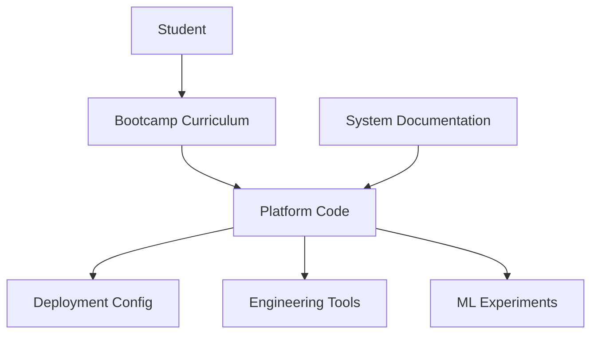
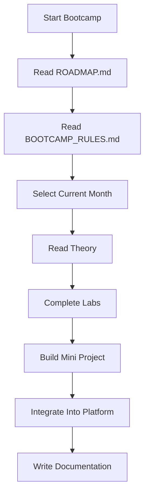
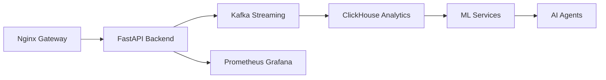
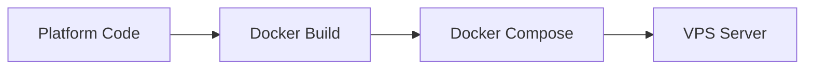
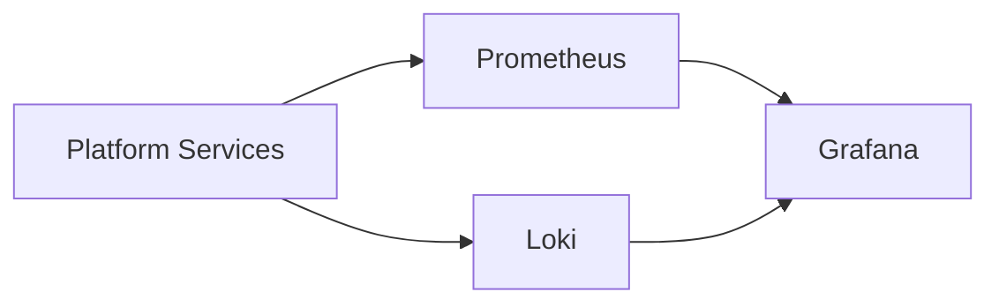
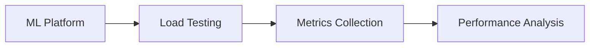
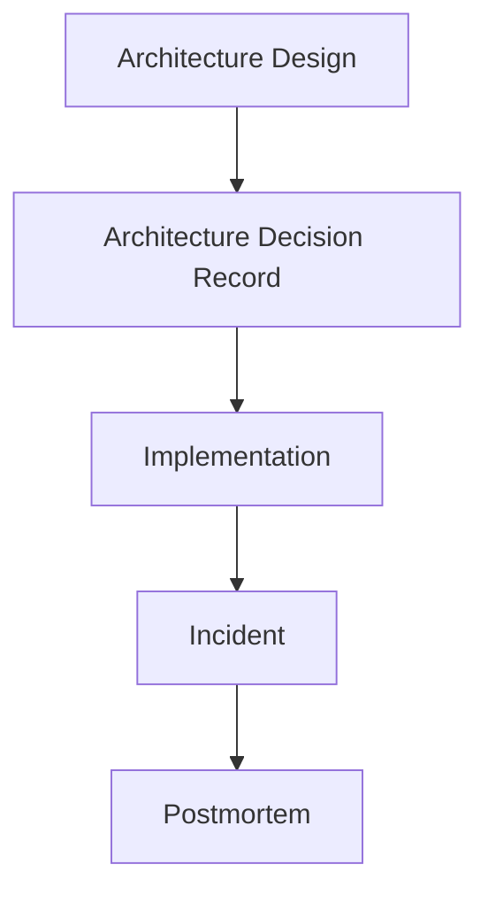

Dưới đây là **Hướng dẫn sử dụng toàn bộ bộ tài liệu `ai-ml-platform-bootcamp`** dựa trên cấu trúc repo mà chúng ta đã thiết kế. Mục tiêu của tài liệu này là giúp người học **không bị lạc trong repo lớn**, biết **bắt đầu từ đâu → đi theo thứ tự nào → khi nào đọc gì → khi nào code gì**.

---

# 📘 Hướng Dẫn Sử Dụng Bộ Tài Liệu

## AI ML Platform Bootcamp

---

# 🎯 Mục tiêu của bộ tài liệu

Bootcamp này không phải là khóa học ML thông thường.

Nó được thiết kế để đào tạo **ML Platform Engineer / MLOps Engineer** có khả năng:

* Thiết kế **ML infrastructure**
* Xây **data pipeline production**
* Triển khai **model serving**
* Xây **observability cho ML**
* Tự động hóa **ML lifecycle**
* Orchestrate **AI Agents**

Sau khi hoàn thành, bạn có thể:

* thiết kế ML platform từ đầu
* vận hành hệ thống ML production
* làm việc ở vai trò **Senior ML Platform Engineer**

---

# 🧠 Triết lý học của Bootcamp

Bootcamp áp dụng mô hình:

```
Theory → Lab → Mini Project → Production System
```

Nguyên tắc:

1️⃣ Không học lý thuyết suông
2️⃣ Không code “demo toy project”
3️⃣ Mọi thứ đều hướng tới **production system**

---

# 🧭 Cách điều hướng trong repo

Repository được chia thành **6 layer chính**.



Ý nghĩa:

| Layer       | Vai trò            |
| ----------- | ------------------ |
| bootcamp    | nội dung học       |
| platform    | code hệ thống      |
| docs        | tài liệu kiến trúc |
| deployments | cấu hình deploy    |
| tools       | test hệ thống      |
| experiments | thử nghiệm ML      |

---

# 📁 Bắt đầu từ đâu?

Người học **LUÔN bắt đầu từ đây**:

```
README.md
```

Sau đó:

```
ROADMAP.md
```

Hai file này giúp hiểu:

* bootcamp kéo dài bao lâu
* mỗi phase học gì
* mục tiêu cuối cùng là gì

---

# 📚 Luồng học chuẩn

Luồng học chuẩn của Bootcamp:



---

# 📂 Cách học trong từng tháng

Ví dụ **Month 1**

```
bootcamp/
└── month1-production-infra/
```

Bên trong sẽ có:

```
README.md
ROADMAP.md
SPRINT1.md
SPRINT2.md
```

Thứ tự đọc:

```
1. README.md
2. ROADMAP.md
3. SPRINT1.md
4. theory/*
5. labs/*
6. projects/*
```

---

# 🧪 Cách thực hành Lab

Các lab nằm ở:

```
bootcamp/monthX/labs/
```

Ví dụ:

```
lab1-linux-server.md
lab2-docker-setup.md
lab3-nginx-https.md
```

Quy trình:

```
1. Đọc lý thuyết
2. Thực hành lab
3. Commit code
4. Viết notes
```

---

# 🏗 Cách phát triển hệ thống platform

Code hệ thống thực nằm ở:

```
platform/
```

Ví dụ:

```
platform/backend
platform/streaming
platform/ml-services
platform/agents
platform/observability
```

Kiến trúc logic:



---

# 🚀 Cách deploy hệ thống

Deployment config nằm tại:

```
deployments/
```

Ví dụ:

```
deployments/docker
deployments/compose
deployments/k8s
```

Flow deploy:



---

# 📊 Monitoring hệ thống

Monitoring stack nằm tại:

```
platform/observability
```

Bao gồm:

```
Prometheus
Grafana
Loki
```

Architecture:



---

# 🧠 Cách làm ML experiments

ML experiments không nằm trong core platform.

Chúng nằm tại:

```
experiments/
```

Ví dụ:

```
experiments/notebooks
experiments/prototypes
```

Workflow:

```
Experiment → Prototype → Production Service
```

---

# 🧰 Engineering tools

Các tool phục vụ testing nằm ở:

```
tools/
```

Ví dụ:

```
load-testing
benchmarking
scripts
```

Flow test:



---

# 📚 Documentation Engineering

Mọi quyết định kỹ thuật phải ghi lại tại:

```
docs/
```

Ví dụ:

```
architecture/
decisions/
runbooks/
postmortems/
```

Luồng tài liệu:



---

# 🧱 Quy tắc sử dụng Bootcamp

1️⃣ Không skip lab
2️⃣ Không skip documentation
3️⃣ Mỗi sprint phải có demo
4️⃣ Mỗi phase phải refactor
5️⃣ Mọi service phải containerized

---

# 🧠 Thời gian học đề xuất

Bạn nói có:

```
3h / ngày
```

Phân bổ:

| Activity      | Time    |
| ------------- | ------- |
| Theory        | 45 phút |
| Lab           | 1h      |
| Coding        | 1h      |
| Documentation | 15 phút |

---

# 🎯 Mục tiêu sau 9 tháng

Bạn sẽ có portfolio:

```
AI Driven ML Platform
```

Bao gồm:

* streaming pipeline
* ML lifecycle
* observability
* model serving
* AI agents orchestration

Đây là level:

```
Senior ML Platform Engineer
```

---

💡 Nếu bạn muốn, bước tiếp theo mình sẽ viết một tài liệu **rất quan trọng nhưng ít người nghĩ tới**:

```
BOOTCAMP_RULES.md
```

Nó sẽ định nghĩa:

* kỷ luật học
* cách commit code
* cách viết docs
* cách review system

để bootcamp này **thực sự giống chương trình training của Big Tech** chứ không phải repo học cá nhân.
